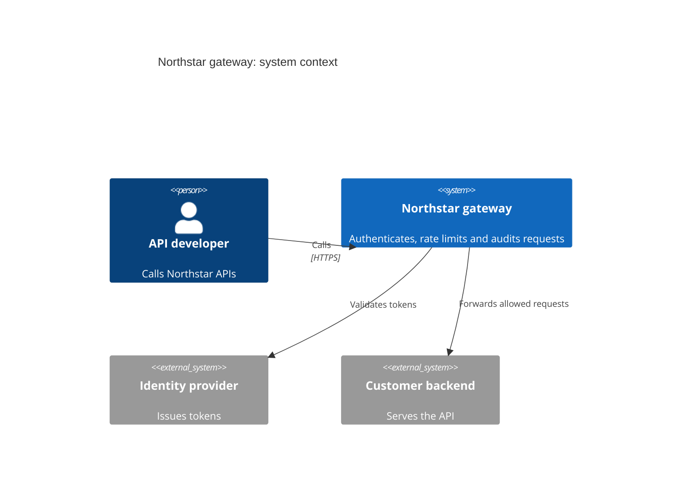

```mermaid
C4Context
  title Northstar gateway: system context
  Person(dev, "API developer", "Calls Northstar APIs")
  System(gw, "Northstar gateway", "Authenticates, rate limits and audits requests")
  System_Ext(idp, "Identity provider", "Issues tokens")
  System_Ext(backend, "Customer backend", "Serves the API")
  Rel(dev, gw, "Calls", "HTTPS")
  Rel(gw, idp, "Validates tokens")
  Rel(gw, backend, "Forwards allowed requests")
```
