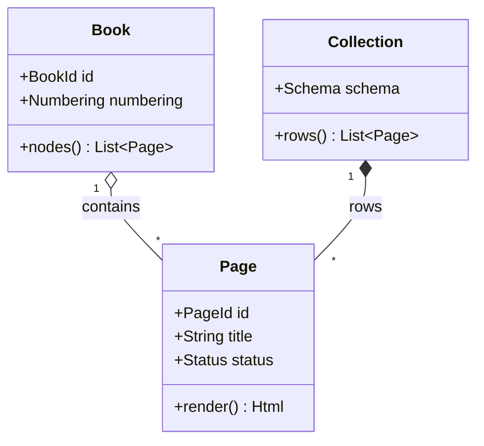

```mermaid
classDiagram
  class Page {
    +PageId id
    +String title
    +Status status
    +render() Html
  }
  class Book {
    +BookId id
    +Numbering numbering
    +nodes() List~Page~
  }
  class Collection {
    +Schema schema
    +rows() List~Page~
  }
  Book "1" o-- "*" Page : contains
  Collection "1" *-- "*" Page : rows
```
