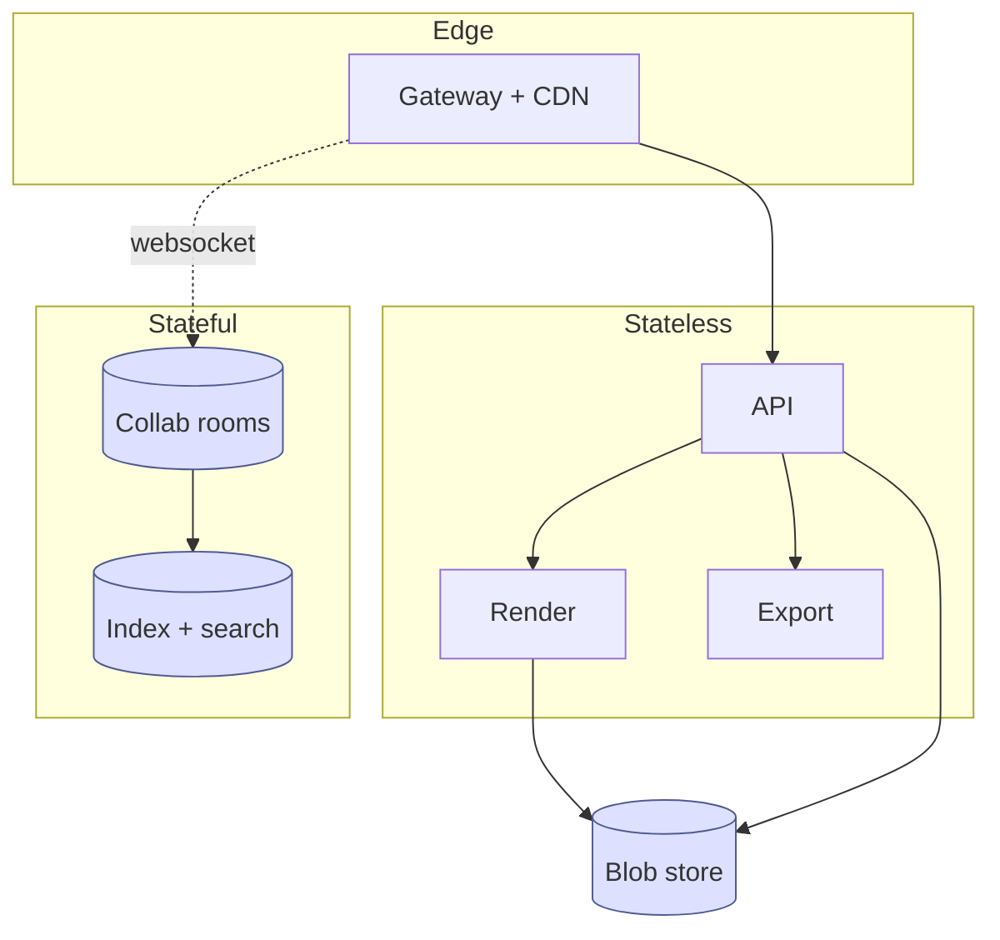

```mermaid
flowchart TB
  subgraph Edge
    GW[Gateway + CDN]
  end
  subgraph Stateless
    API[API] --> REN[Render]
    API --> EXP[Export]
  end
  subgraph Stateful
    COL[(Collab rooms)]
    IDX[(Index + search)]
  end
  GW --> API
  GW -. websocket .-> COL
  COL --> IDX
  REN --> BLOB[(Blob store)]
  API --> BLOB
  classDef store fill:#DDE1FF,stroke:#4F5B92;
  class COL,IDX,BLOB store;
```
