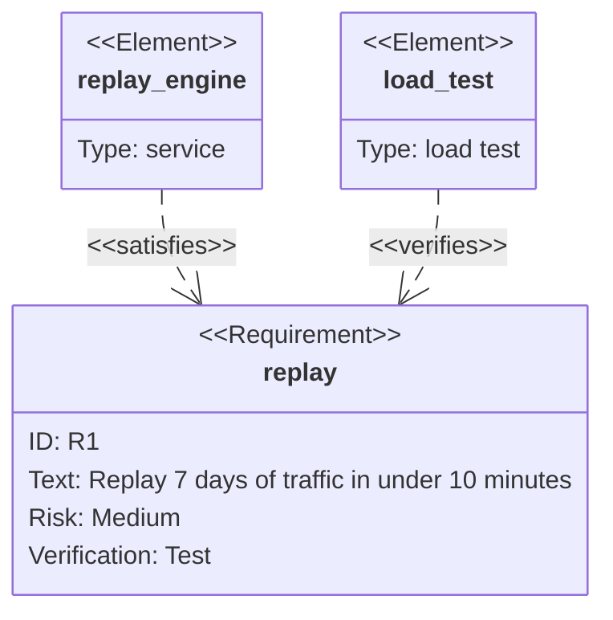

```mermaid
requirementDiagram
  requirement replay {
    id: R1
    text: Replay 7 days of traffic in under 10 minutes
    risk: medium
    verifymethod: test
  }
  element replay_engine {
    type: service
  }
  element load_test {
    type: "load test"
  }
  replay_engine - satisfies -> replay
  load_test - verifies -> replay
```
