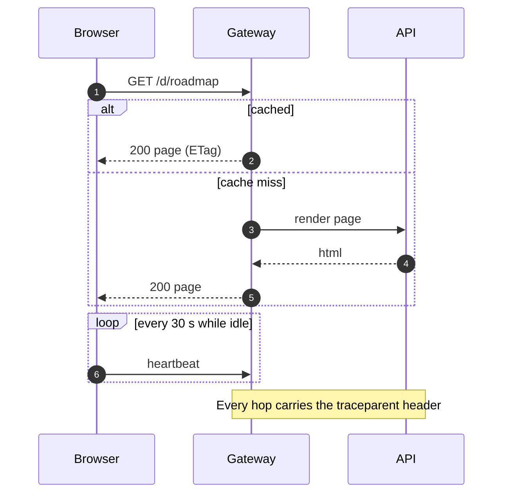

```mermaid
sequenceDiagram
  autonumber
  participant B as Browser
  participant G as Gateway
  participant A as API
  B->>G: GET /d/roadmap
  alt cached
    G-->>B: 200 page (ETag)
  else cache miss
    G->>A: render page
    A-->>G: html
    G-->>B: 200 page
  end
  loop every 30 s while idle
    B->>G: heartbeat
  end
  Note over G,A: Every hop carries the traceparent header
```
